# Service lifecycle

One orchestrator owns mutating service lifetime: `apps/web/src/lib/service-lifecycle/`.

## Who may write `services.status`

**Only** `transitionService` in `service-lifecycle/transition.ts`.

Call sites go through helpers (`deployService`, `stopService`, `destroyServiceLifecycle`, `markServiceDeploySucceeded`, provision completion, etc.). ORPC handlers must not `.set({ status: … })` on services.

## State machine

```mermaid
stateDiagram-v2
  [*] --> queued: data create
  [*] --> stopped: app create
  queued --> provisioning
  queued --> deploying
  stopped --> deploying
  stopped --> provisioning
  stopped --> destroying
  provisioning --> running
  provisioning --> error
  deploying --> running
  deploying --> error
  deploying --> stopped
  running --> deploying
  running --> stopped
  running --> destroying
  running --> error
  error --> deploying
  error --> provisioning
  error --> destroying
  error --> stopped
  destroying --> error: teardown failed
  destroying --> [*]: row deleted
```

Illegal edges throw `IllegalServiceTransitionError`. Reclaim / finalizer paths use `transitionServiceBestEffort`. Failed destroy leaves `error` (not a stuck `destroying`).

Deprecated: `ready` — writers normalize to `stopped`.

## API surface

| Method | Role |
|--------|------|
| `create` | Insert row + initial status; optional provision enqueue |
| `createAndDeploy` | Create + git webhook; deploy only when `image` provided |
| `deploy` | Op + deployment row + `deploying` → workload driver |
| `stop` | Workload scale 0 + unpublish → `stopped` |
| `destroy` | `destroying` → webhook delete → unpublish → workload → cancel ops → delete row |
| `connectGit` / `disconnectGit` | Desired git fields + webhook registry |
| `reconcileStuckServices` | Heal `deploying`/`provisioning` when last op failed/stale |

Workload execute (`deploy` / `stop` / `scale` / `provision` / `destroy`) lives on `ServiceWorkloadDriver`. Env (including Observe) is assembled once via `buildServiceDeployEnv`.

## Cluster surface helpers

Workload/edge helpers live in `apps/web/src/lib/k8s/surface.ts` (`unpublishServiceSurface`, `destroyWorkload`, `publishEdgeHostname`). They do **not** own `services.status` — only `service-lifecycle/` does.

Live deploy path is k3s via `serviceLifecycle.deploy`. The control-plane Docker deploy queue was removed.
